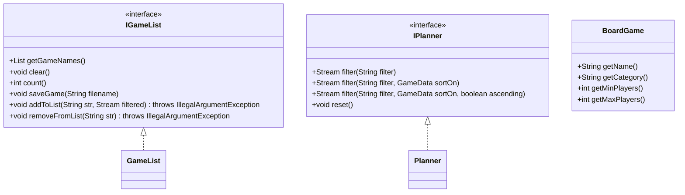
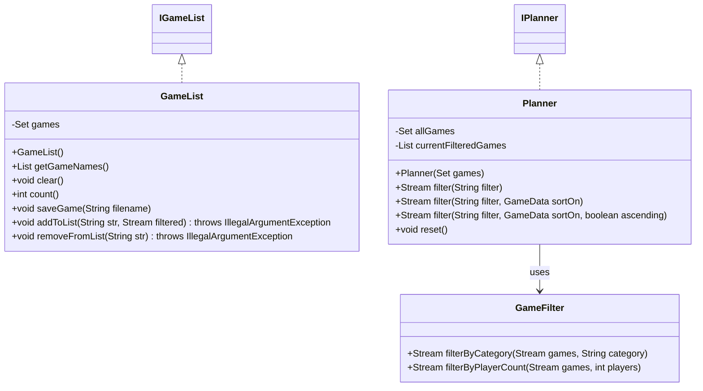

# Board Game Arena Planner Design Document

This document is meant to provide a tool for you to demonstrate the design process. You need to work on this before you code, and after have a finished product. That way you can compare the changes, and changes in design are normal as you work through a project. It is contrary to popular belief, but we are not perfect our first attempt. We need to iterate on our designs to make them better. This document is a tool to help you do that.

## (INITIAL DESIGN): Class Diagram 

Place your class diagrams below. Make sure you check the file in the browser on github.com to make sure it is rendering correctly. If it is not, you will need to fix it. As a reminder, here is a link to tools that can help you create a class diagram: [Class Resources: Class Design Tools](https://github.com/CS5004-khoury-lionelle/Resources?tab=readme-ov-file#uml-design-tools)

### Provided Code

Provide a class diagram for the provided code as you read through it.  For the classes you are adding, you will create them as a separate diagram, so for now, you can just point towards the interfaces for the provided code diagram.
## (INITIAL DESIGN): Class Diagram

### Your Plans/Design

Create a class diagram for the classes you plan to create. This is your initial design, and it is okay if it changes. Your starting points are the interfaces.

## (INITIAL DESIGN): Tests to Write - Brainstorm

Write a test (in english) that you can picture for the class diagram you have created. This is the brainstorming stage in the TDD process. 

> [!TIP]
> As a reminder, this is the TDD process we are following:
> 1. Figure out a number of tests by brainstorming (this step)
> 2. Write **one** test
> 3. Write **just enough** code to make that test pass
> 4. Refactor/update  as you go along
> 5. Repeat steps 2-4 until you have all the tests passing/fully built program

You should feel free to number your brainstorm. 

### **Planned Test Cases**
In Test-Driven Development (TDD), we define test cases first, then write code to satisfy these tests.

#### **（1️1） `GameList` Related Tests**
- **`getGameNames()`**
  - Ensure the returned list of game names is **sorted alphabetically** (case-insensitive).
  - Ensure the list **does not contain duplicate games**.

- **`addToList()`**
  - Add a game by **name** and verify that `count()` updates correctly.
  - Add a game using an **index** (e.g., `"1"`, `"2-4"`) and check if the correct games are added.
  - Use `"all"` to add all games and verify the list contains all expected games.
  - Pass invalid inputs (e.g., `"abc"`, `"10-5"`) and ensure `IllegalArgumentException` is thrown.

- **`removeFromList()`**
  - Remove a game by **name** and verify that `count()` updates correctly.
  - Remove a game by **index** (e.g., `"1"`, `"2-4"`) and check if the correct games are removed.
  - Use `"all"` to clear the list and ensure `count() == 0`.
  - Pass invalid inputs (e.g., `"xyz"`) and ensure `IllegalArgumentException` is thrown.

- **`saveGame()`**
  - Save the game list to a file and verify the file is written correctly.
  - Read the file contents and ensure they match the sorted order of `getGameNames()`.

#### **（2️） `Planner` Related Tests**
- **`filter()`**
  - Filter games by **minimum player count** (e.g., `minPlayers>4`) and verify results.
  - Filter games by **name** (e.g., `name~=chess`) and check if the correct games are returned.
  - Apply **multiple conditions** (e.g., `minPlayers>4,maxPlayers<6`) and verify that games meet both criteria.
  - Apply **multiple filters on the same field** (e.g., `minPlayers>4,minPlayers<6`) and check if results are correct.
  - Pass an invalid filter format and ensure an exception is thrown.

- **`reset()`**
  - After calling `reset()`, verify that all games return to the **unfiltered state**.

## (FINAL DESIGN): Class Diagram

Go through your completed code, and update your class diagram to reflect the final design. Make sure you check the file in the browser on github.com to make sure it is rendering correctly. It is normal that the two diagrams don't match! Rarely (though possible) is your initial design perfect. 

For the final design, you just need to do a single diagram that includes both the original classes and the classes you added. 

> [!WARNING]
> If you resubmit your assignment for manual grading, this is a section that often needs updating. You should double check with every resubmit to make sure it is up to date.
classDiagram
    class AIChatHistory {
        -messages: Message[]
        +addMessage()
        +deleteMessage()
        +clearHistory()
    }

    class Message {
        +id: string
        +content: string
        +role: string
        +timestamp: Date
    }

    class ChatInterface {
        -messages: Message[]
        -isLoading: boolean
        +handleSendMessage()
        +handleDeleteMessage()
        +render()
    }

    class MessageList {
        -messages: Message[]
        +render()
    }

    class MessageInput {
        -inputValue: string
        +handleSubmit()
        +handleInputChange()
    }

    class ChatMessage {
        +message: Message
        +onDelete()
        +render()
    }

    class LocalStorage {
        +saveMessages()
        +loadMessages()
        +clearMessages()
    }

    class APIService {
        +sendMessage()
        +getResponse()
    }

    AIChatHistory --> Message : contains
    AIChatHistory --> LocalStorage : uses
    AIChatHistory --> APIService : uses
    ChatInterface --> MessageList : contains
    ChatInterface --> MessageInput : contains
    MessageList --> ChatMessage : contains
    ChatMessage --> Message : uses

## (FINAL DESIGN): Reflection/Retrospective

Wow, this project really taught me a lot! When I first started, I thought I had a pretty good plan with my initial design, but boy was I wrong about some things. The biggest "aha" moment came when I was struggling with all the filtering logic in my Planner class - it was getting super messy and hard to read. That's when I realized I needed to break things up and created a separate GameFilter class. It's funny how something can seem so obvious after you figure it out!

I also learned the hard way about choosing the right data structures. I started with Lists everywhere because, well, that's what I was comfortable with. But after running into issues with duplicate games and slow lookups, I switched to using Sets. It made such a big difference! The code became faster and simpler - definitely a lesson I won't forget.

The hardest part? Definitely the filtering system. At first, I thought "Oh, I just need to split the string and check some conditions, easy!" But then I had to deal with things like "minPlayers>4,maxPlayers<6" and sorting options, and suddenly it wasn't so simple anymore. I spent a lot of time debugging edge cases I hadn't even thought about in my initial design.

If I could do it all over again, I'd probably spend more time planning out how to handle all these different filter combinations before jumping into coding. But you know what? Sometimes you just have to start building something to realize what you actually need. This project really showed me that it's okay for your design to change as you go - that's just part of the learning process!
